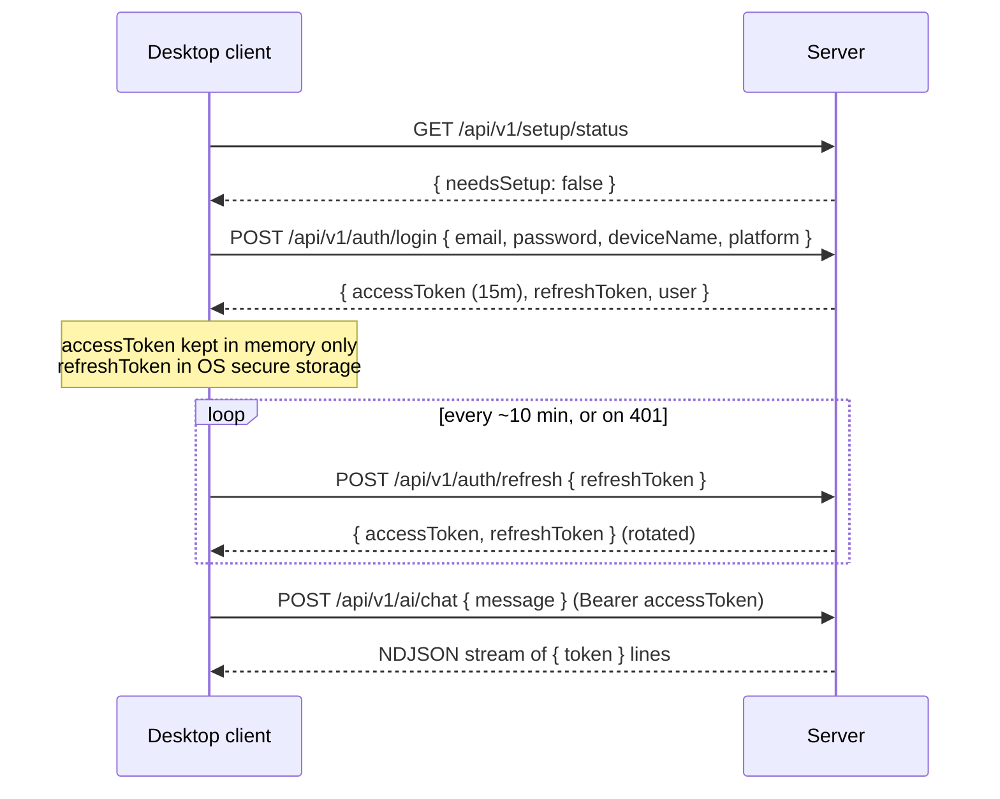

# REST API design

Base path: `/api/v1`. JSON everywhere except the AI streaming endpoint (NDJSON,
see [ADR-0005](adr/0005-ai-streaming.md)). Every request after login carries
`Authorization: Bearer <accessToken>` and `X-Client-Version: <semver>`.

## Conventions

- Money fields are integer cents over the wire too (`amountCents`), formatted
  client-side — never trust a client-formatted currency string back.
- List endpoints are cursor-paginated: `?cursor=<opaque>&limit=50`, response
  includes `nextCursor: string | null`.
- Mutations return the full updated resource, not just `{ ok: true }`.
- Errors: `{ error: { code: string, message: string, fields?: Record<string,string> } }`
  with a matching HTTP status. `code` is a stable machine-readable string
  (`INVALID_CREDENTIALS`, `SESSION_REVOKED`, `VALIDATION_ERROR`, …) — clients
  switch on `code`, not on `message` text.

## Version & health

| Method | Path | Notes |
|---|---|---|
| GET | `/api/v1/version` | `{ apiVersion, minClientVersion }`. Unauthenticated. Client compares its own version and blocks with an "update required" screen if below `minClientVersion`. |
| GET | `/api/v1/health` | Liveness for Docker healthcheck. Unauthenticated. |

## Setup wizard (first run only)

| Method | Path | Notes |
|---|---|---|
| GET | `/api/v1/setup/status` | `{ needsSetup: boolean }`. Unauthenticated — this is how the desktop app knows to show the wizard vs. the login screen on first connect to a fresh server. |
| POST | `/api/v1/setup/complete` | `{ ownerEmail, ownerPassword, ownerDisplayName, dbConfirmed, aiConfig? }` → creates the owner user, seeds default categories, marks setup complete. Route 404s after first completion. |

## Auth

| Method | Path | Notes |
|---|---|---|
| GET | `/api/v1/auth/profiles` | Unauthenticated: `{ profiles: [{ id, displayName, avatarColor }] }` — powers the design's login profile picker. Emails are deliberately excluded; exposing household display names to the LAN is an accepted trade-off for a self-hosted household app. |
| POST | `/api/v1/auth/login` | `{ email \| userId, password, deviceName, platform }` → `{ accessToken, refreshToken, user }`. `userId` comes from the profile picker; `email` remains for scripts/recovery. Rate-limited (Redis-backed if present, in-memory fallback otherwise). |
| POST | `/api/v1/auth/refresh` | `{ refreshToken }` → `{ accessToken, refreshToken }`. Rotates the refresh token; reuse of an already-rotated token revokes the session. |
| POST | `/api/v1/auth/logout` | `{ refreshToken }` → revokes that session. |
| GET | `/api/v1/auth/sessions` | List the current user's device sessions (id, deviceName, platform, ipAddress, lastUsedAt, isCurrent). |
| DELETE | `/api/v1/auth/sessions/:id` | Revoke a specific session (e.g. a lost laptop). |
| GET | `/api/v1/me` | Current user profile. |
| PATCH | `/api/v1/me` | Update display name / avatar color / password. |

## Household

| Method | Path | Notes |
|---|---|---|
| GET | `/api/v1/household/members` | List users on this server. |
| POST | `/api/v1/household/members` | Owner-only: create a member account (no email server assumed — owner sets an initial password the member changes on first login). |
| DELETE | `/api/v1/household/members/:id` | Owner-only. |

## Accounts

| Method | Path | Notes |
|---|---|---|
| GET | `/api/v1/accounts` | `?type=&archived=false` |
| POST | `/api/v1/accounts` | |
| GET | `/api/v1/accounts/:id` | |
| PATCH | `/api/v1/accounts/:id` | |
| DELETE | `/api/v1/accounts/:id` | Soft delete (`archived_at`) if it has transactions; hard delete otherwise. |

## Transactions

| Method | Path | Notes |
|---|---|---|
| GET | `/api/v1/transactions` | `?accountId=&categoryId=&search=&from=&to=&cursor=&limit=` — `search` hits the merchant-name full-text index. |
| POST | `/api/v1/transactions` | |
| GET | `/api/v1/transactions/:id` | |
| PATCH | `/api/v1/transactions/:id` | Includes re-categorization. |
| DELETE | `/api/v1/transactions/:id` | |
| POST | `/api/v1/transactions/import` | `{ accountId, csv }` (CSV as a JSON string field — household CSVs are small, and this keeps every endpoint JSON; revisit as multipart only if receipts-scale uploads ever need it) → `{ imported, skippedDuplicates, errors[] }`, dedupes on `external_id`; rows without one get a deterministic content hash so re-importing the same file is idempotent. |
| POST | `/api/v1/transactions/:id/attachments` | multipart file upload (receipts). |
| GET | `/api/v1/attachments/:id` | Streams the file; server enforces the requester owns the parent transaction's household. |

## Categories

| Method | Path | Notes |
|---|---|---|
| GET | `/api/v1/categories` | |
| POST | `/api/v1/categories` | |
| PATCH | `/api/v1/categories/:id` | |
| DELETE | `/api/v1/categories/:id` | Rejected with `CATEGORY_IN_USE` if system category or has transactions/budgets — client shows a reassign-first flow. |

## Budgets

| Method | Path | Notes |
|---|---|---|
| GET | `/api/v1/budgets` | `?month=2026-06` — returns each category's budget plus `spentCents` computed from that month's transactions. |
| POST | `/api/v1/budgets` | |
| PATCH | `/api/v1/budgets/:id` | |
| DELETE | `/api/v1/budgets/:id` | |

## Cash flow

| Method | Path | Notes |
|---|---|---|
| GET | `/api/v1/cashflow/summary` | `?months=6` → income/spending/savings-rate per month, drives the bar chart. |
| GET | `/api/v1/cashflow/sankey` | `?month=2026-06` → `{ nodes: [...], links: [...] }` ready for the frontend's Sankey renderer — see the `sankeyGeo()`/`buildSankey()` logic already in `design/reference/Finance App v3.dc.html` as the layout this data feeds. |

## Investments

| Method | Path | Notes |
|---|---|---|
| GET | `/api/v1/investment-accounts` | Accounts of type `investment`, with holdings and computed allocation %. |
| GET | `/api/v1/investment-accounts/:id/holdings` | |
| POST | `/api/v1/investment-accounts/:id/holdings` | |
| PATCH | `/api/v1/holdings/:id` | |
| DELETE | `/api/v1/holdings/:id` | |

## Savings goals

| Method | Path | Notes |
|---|---|---|
| GET | `/api/v1/goals` | |
| POST | `/api/v1/goals` | |
| PATCH | `/api/v1/goals/:id` | |
| DELETE | `/api/v1/goals/:id` | |

## Reports

| Method | Path | Notes |
|---|---|---|
| GET | `/api/v1/reports/monthly` | `?month=2026-06` → summary + cached/generated AI commentary. |
| GET | `/api/v1/reports/yearly` | `?year=2026` |
| GET | `/api/v1/export/csv` | `?type=transactions&from=&to=` → CSV download, generated on request, never cached with financial detail on disk. |

## AI

| Method | Path | Notes |
|---|---|---|
| GET | `/api/v1/ai/status` | `{ reachable, model, host, port }` — every AI-touching UI element checks this first. |
| POST | `/api/v1/ai/settings` | Owner-only: `{ ollamaHost, ollamaPort, modelName, enabled }`. |
| GET | `/api/v1/ai/conversations` | |
| GET | `/api/v1/ai/conversations/:id` | Includes full message history. |
| DELETE | `/api/v1/ai/conversations/:id` | |
| POST | `/api/v1/ai/chat` | `{ conversationId?, message }` → **streaming NDJSON response**, one `{ token: string }` line per chunk, final line `{ done: true, conversationId }`. Backs: natural-language Q&A, "explain spending," "budget recommendations," "cash-flow summaries," "spending comparisons," "savings recommendations," "forecasting," "investment summaries" — all are prompt templates server-side against the same endpoint, not separate routes. |

## Settings

| Method | Path | Notes |
|---|---|---|
| GET | `/api/v1/settings` | Theme default, currency, locale. |
| PATCH | `/api/v1/settings` | |

## Auth flow sequence

