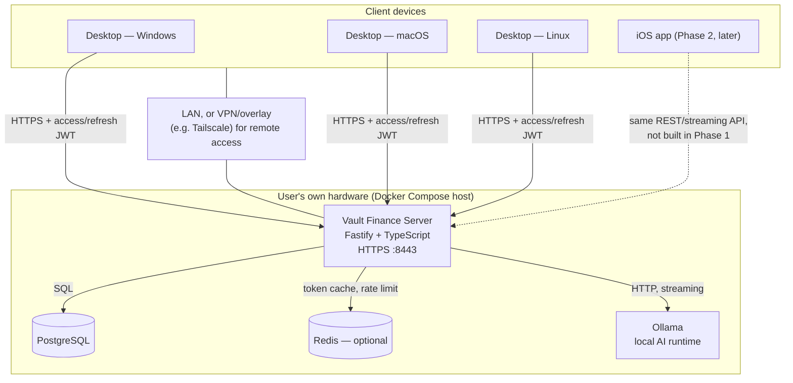

# Architecture

## Summary

Vault Finance is a client–server system. Each user runs one **server** on their own
hardware (Docker Compose); every household member connects to it with a **desktop
app** (Windows/macOS/Linux, Phase 1) and, later, an **iOS app** (Phase 2) that
speaks the same API. There is no multi-tenant cloud component — the maintainer of
this codebase never sees a user's data or runs any infrastructure for them.

## Stack

| Layer | Choice | Why |
|---|---|---|
| Backend | Node.js 22 + TypeScript, Fastify | See [ADR-0001](adr/0001-backend-framework.md) |
| ORM / migrations | Drizzle ORM + drizzle-kit | SQL-first, typed, no codegen step, small runtime — fits a self-hosted single-instance app better than Prisma's engine binary |
| Validation / contracts | Zod, `zod-to-openapi` | One schema drives request validation, response typing, and a generated OpenAPI doc future clients (incl. Swift) can codegen against |
| Database | PostgreSQL 16 | Requested; correct choice for relational financial data with strong constraints |
| Cache / sessions | Redis 7 (optional) | Refresh-token revocation lookups, login rate-limiting, cached dashboard aggregates. The server runs without it — see degrade-gracefully note below |
| Local AI | Ollama, HTTP API | Requested; self-hosted, no cloud AI calls ever |
| Desktop shell | Tauri 2.x | See [ADR-0002](adr/0002-desktop-framework.md) |
| Frontend | React + TypeScript + Vite | Matches the existing Claude Design source-of-truth (`design/reference/Finance App v3*.dc.html`), reusable for Phase 2 iOS via Tauri 2's iOS target |
| Monorepo tooling | pnpm workspaces + Turborepo | Shared TS types between server and desktop without publishing packages |

## Network diagram

Every arrow into `SRV` uses the same versioned REST API described in
[api-design.md](api-design.md). Nothing in the diagram is specific to desktop —
that's intentional, so the Phase 2 iOS app is a new client on this diagram, not a
new backend.

## Client–server connectivity

- **Server address is user-configured.** No client hardcodes `localhost`. The
  desktop app's first-run flow asks for a host (LAN hostname/IP, or a Tailscale
  MagicDNS name) and a port, stores it locally (OS keychain via Tauri's
  secure-storage plugin holds the refresh token; the address itself is plain
  config), and every subsequent request goes through one `ApiClient` instance
  built from that config.
- **TLS is mandatory, trust is Trust-On-First-Use (TOFU).** The server always
  serves HTTPS. For a proper CA-issued cert (e.g. the user fronts the server with
  Caddy/Let's Encrypt, or connects over Tailscale's HTTPS), normal validation
  applies. For the common self-hosted case (self-signed cert, or the internal CA
  the setup wizard generates), the client pins the certificate's SHA-256
  fingerprint on first connect — exactly like an SSH host key — and warns loudly
  if it ever changes. This avoids asking a non-technical household member to
  import a root CA into their OS trust store. Documented in
  [self-hosting.md](self-hosting.md).
- **Auth**: short-lived access JWT (15 min) + rotating opaque refresh token,
  bound to a per-device session row the user can list and revoke from Settings.
  Detailed in [ADR-0003](adr/0003-auth-design.md) and
  [api-design.md](api-design.md).
- **Reconnection**: the API client wraps every call; on network failure it
  surfaces a global "Reconnecting…" banner state (not a full-screen error),
  retries with backoff, and queues no writes — in-flight mutations fail
  explicitly rather than silently retrying, so the user never wonders whether a
  transaction was saved twice.
- **Version compatibility**: `GET /api/v1/version` returns the server's API
  version and its `minClientVersion`. Every client request sends
  `X-Client-Version`; the server responds `426 Upgrade Required` with a
  human-readable message if the client is below `minClientVersion`, which the
  client renders as a blocking "please update" screen instead of failing
  opaquely.

## AI integration

- **AI is optional and off by default.** Out of the box there is no assistant
  UI at all — the owner opts in from Settings → AI, choosing a provider and
  supplying their own credentials. Until then nothing is sent anywhere. This
  is a deliberate revision of the original "local AI only, no cloud, ever"
  stance ([ADR-0006](adr/0006-optional-multi-provider-ai.md)).
- **Three providers, bring-your-own-key:** local **Ollama** (base URL
  configurable — the bundled Docker service or any box on the LAN), **OpenAI**,
  and **Anthropic (Claude)**. The server holds the credentials (in its own
  Postgres, never returned to clients) and makes all outbound provider calls,
  so a key lives only on the user's own server. Cloud providers are integrated
  via their official SDKs; Ollama via its native HTTP API.
- **Privacy honesty:** with Ollama, nothing leaves the user's hardware. With a
  cloud provider, a bounded financial-context summary is sent to that provider
  under the user's key when they ask a question — the desktop Settings screen
  shows an explicit warning before a cloud provider can be enabled.
- The server proxies the chosen provider's stream as newline-delimited JSON
  (NDJSON) over a chunked HTTP response, not Server-Sent Events — `EventSource`
  can't send an `Authorization` header, and this API is bearer-token
  authenticated end to end. The desktop client reads the response body with a
  `ReadableStream` reader and appends tokens as they arrive.
- `GET /api/v1/ai/status` reports `{ enabled, configured, reachable, provider,
  ... }`. Every AI-touching surface (the Assistant nav item and page, the "Ask
  AI" button, Reports commentary) is hidden until AI is both enabled and
  configured, and degrades gracefully if the provider later becomes
  unreachable. No other module depends on AI being present.

## Where Phase 2 (iOS) fits

Nothing above is desktop-specific by design:

- The API is the same REST/streaming contract regardless of client.
- Auth already models "per-device session," not "per-desktop-session" — an iOS
  device is just another row.
- Tauri 2 targets iOS from the same Rust shell + web frontend, so the
  `apps/desktop` frontend (React components, API client, state) is the intended
  starting point for `apps/ios` in Phase 2, not a rewrite.
- The one Phase-1 decision that would make Phase 2 harder if done wrong: baking
  desktop-only assumptions (hover states as the only affordance, fixed-width
  layouts, filesystem-path-based config) into shared components. The component
  library in `packages/ui` must stay pointer/touch-agnostic — see
  [folder-structure.md](folder-structure.md).

## Privacy & deployment posture

- No telemetry, analytics, or crash reporting phones home, anywhere in the
  stack.
- Uploaded receipts/exports/backups are Docker volumes on the user's host,
  never proxied through or copied to any third party.
- The only outbound network call from a shipped binary that isn't the user's
  own server is the desktop auto-updater checking/downloading a new release.
